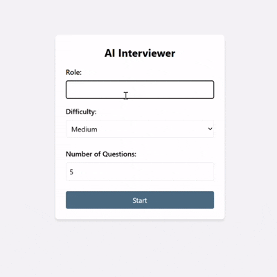

# AI Interview Coach – React Frontend

## Overview
The **AI Interview Coach Frontend** is a React-based chat UI for mock interviews.  
It connects to the **FastAPI backend** and allows users to:
- Choose a role (e.g., Python Developer, Java Developer, AI/ML Engineer)
- Select a difficulty level (Easy, Medium, Hard)
- Enter the number of questions for the interview
- Answer dynamically generated questions
- Receive feedback & scoring in real-time
- View a final report with total score, average score, and improvement suggestions


---

## Tech Stack
- React (with hooks)
- Axios (API requests)
- Tailwind CSS (styling)
- React Markdown (for rendering AI feedback)

---

## Installation

### Clone the repository
```bash
git clone https://github.com/your-username/ai_interview_coach_frontend.git
cd ai_interview_coach_frontend
```

### Install dependencies
```bash
npm install
```

### Configure Backend URL
Update `src/api.js` if backend runs on another port:
```javascript
const API_BASE = "http://127.0.0.1:8000";
```

---

## Running the App
```bash
npm start
```
The app will open at: http://localhost:3000

---

## Workflow
1. Start Session -> role, difficulty, question count  
2. Answer questions -> AI evaluates + gives feedback  
3. End -> View report with **Total Score, Avg Score, Feedback, Improvements**  

---

## Features
- Chat-style interface  
- Configurable session setup  
- Real-time feedback  
- Final report page  
- Responsive design  
- AI feedback rendered with Markdown  

---

## Backend Repository
[AI Interview Coach – FastAPI Backend](https://github.com/johnathikalam/ai_interview_coach)
